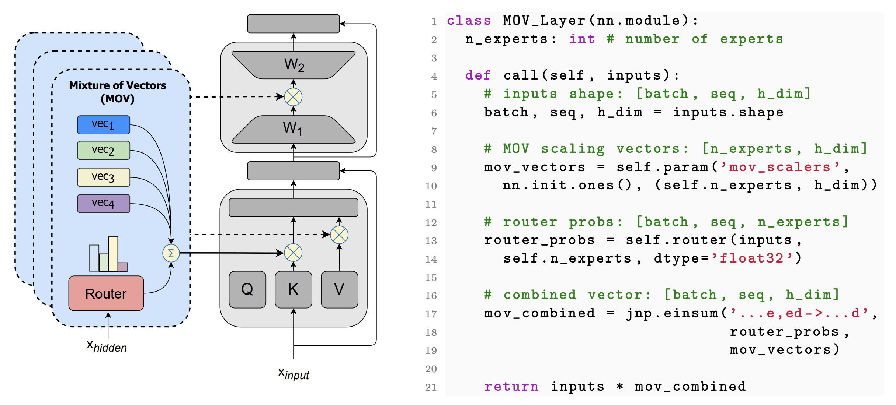

## MoV and MoLoRA
This repository contains the official code for the paper: "[Pushing Mixture of Experts to the Limit: Extremely Parameter Efficient MoE for Instruction Tuning](https://arxiv.org/abs/2309.05444)."

The codebase is built on [T5X](https://github.com/google-research/t5x), which
defines the model and training loop;
[Flaxformer](https://github.com/google/flaxformer), which defines the
model computation; [Flax](https://github.com/google/flax), which defines the low
level model layers; and [Jax](https://github.com/google/jax), which provides the execution



#### Installation

    # CLONE repo 
    git clone https://github.com/for-ai/parameter-efficient-moe
    
    # COPY to TPUs
    gcloud alpha compute tpus tpu-vm scp --recurse parameter-efficient-moe <TPU_NAME>:parameter-efficient-moe --zone <TPU_ZONES> --worker=all

    # RUN on TPUs
    bash scripts/setup.sh


### Dataset
The dataset that is used for training and evaluation should be cached using [SeqIO](https://github.com/google/seqio). We used [bigscience/P3](https://huggingface.co/datasets/bigscience/P3) dataset which is already prepared. For the dataset preparation, we refer [bigscience/t-zero](https://github.com/bigscience-workshop/t-zero/tree/master/training) repository.

### Code components

Here is the code layout:

*   `configs/` :: contains configs for the architecture of the each models including T0, IA3, LoRA, MoV, MoLoRa using gin style configuration. 
*   `scripts/` :: contains all the training and evaluation files for full fine-tuning, vanilla parameter-efficient fine-tuning, and their mixture counterpart fine-tuning.
*   `src/` :: contains IA3, LoRA, MoV and MoLoRa computations, including the router they use.


#### Example script

    gcloud alpha compute tpus tpu-vm ssh <TPU_NAME> --zone <TPU_ZONES> --worker=all --command "cd parameter-efficient-moe; bash scripts/mov_train.sh"


#### Fine-tuning:

```sh
# moe/scripts/mov_train.sh

MODEL_DIR=${1:-${MODEL_DIR}} # Model dir to save logs, ckpts, etc. in "gs://model_dir" format.

T5X_DIR="`python3 -m scripts.find_module t5x`/.." # directory where the T5X repo is cloned.
FLAXFORMER_DIR="`python3 -m scripts.find_module flaxformer`/.." # directory where the Flaxformer repo is cloned.
echo "Searching for gin configs in:"
echo "- ${T5X_DIR}"
echo "- ${FLAXFORMER_DIR}"
echo "============================="

PRETRAINED_MODEL="gs://t5-data/pretrained_models/t5x/t5_1_1_lm100k_large/checkpoint_1100000"
CACHE_DIR="raw_tfrecords/you_cache_dir" # Directory where P3 cached data is stored, etc. in "gs://model_dir" format.

python3 -m t5x.train \
    --gin_search_paths="${T5X_DIR}" \
    --gin_file="configs/t5/models/t5_1_1_large.gin" \ #e.g. 770M(t5-large) model
    --gin_file="configs/mov.gin" \ # Use MoV as the architecture for PEFT
    --gin.MODEL_DIR="'${MODEL_DIR}'" \
    --gin.LOSS_NORMALIZING_FACTOR="'AVERAGE_PER_SEQUENCE'" \
    --gin.MIXTURE_OR_TASK_NAME="'t0_train'" \ # Training subset
    --gin.TASK_FEATURE_LENGTHS="{'inputs': 1024, 'targets': 256}" \
    --gin.INITIAL_CHECKPOINT_PATH="'${PRETRAINED_MODEL}'" \
    --gin.TRAIN_STEPS="1_600_000" \ # Pre-trained + number of steps
    --gin.USE_CACHED_TASKS="True" \ 
    --gin.PACKING="True" \
    --seqio_additional_cache_dirs=${CACHE_DIR} \
    --gin.BATCH_SIZE="32" 
```

#### Evaluation:

```sh
# moe/scripts/mov_eval.sh

CKPT_DIR=${1:-${CKPT_DIR}} # directory where the fine-tune model is stored
EVAL_DIR=${2:-${EVAL_DIR}} # directory to write eval output

T5X_DIR="`python3 -m scripts.find_module t5x`/.." #directory where the t5x is cloned
FLAXFORMER_DIR="`python3 -m scripts.find_module flaxformer`/.." #directory where the flaxformer is cloned
echo "Searching for gin configs in:"
echo "- ${T5X_DIR}"
echo "- ${FLAXFORMER_DIR}"
echo "============================="

CACHE_DIR="raw_tfrecords/you_cache_dir" # directory where P3 cached data is stored, etc. in "gs://model_dir" format.

python3 -m t5x.eval \
  --gin_search_paths="${T5X_DIR}" \
  --gin_file="configs/t5/models/t5_1_1_large.gin" \
  --gin_file="configs/mov_eval.gin" \ # Use MoV as the architecture for PEFT
  --gin.EVAL_OUTPUT_DIR="'${EVAL_DIR}'" \
  --gin.MIXTURE_OR_TASK_NAME="'t0_eval_score_eval'" \ # Evaluation subset
  --gin.TASK_FEATURE_LENGTHS="{'inputs': 1024, 'targets': 256}" \
  --gin.CHECKPOINT_PATH="'${CKPT_DIR}'" \
  --seqio_additional_cache_dirs=${CACHE_DIR} \
  --gin.utils.DatasetConfig.use_cached="True" \
  --gin.utils.DatasetConfig.split="'validation'" \
  --gin.BATCH_SIZE="32" 
```
#### References
Our IA3 module implementation is the based on [prompt-tuning](https://github.com/google-research/prompt-tuning), and we used [bigscience/t-zero](https://github.com/bigscience-workshop/t-zero/tree/master/training) for implementation of the dataset.

#### Citation
Please use the following bibtex entry to cite our work.

```
@article{zadouri2023pushing,
      url = {https://arxiv.org/abs/2309.05444}
      title={Pushing Mixture of Experts to the Limit: Extremely Parameter Efficient MoE for Instruction Tuning}, 
      author={Ted Zadouri and Ahmet Üstün and Arash Ahmadian and Beyza Ermiş and Acyr Locatelli and Sara Hooker},
      year={2023},
}
```


